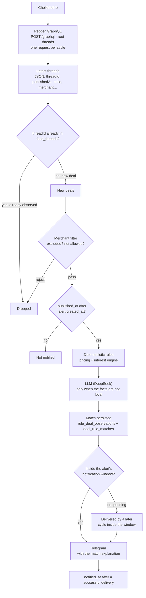
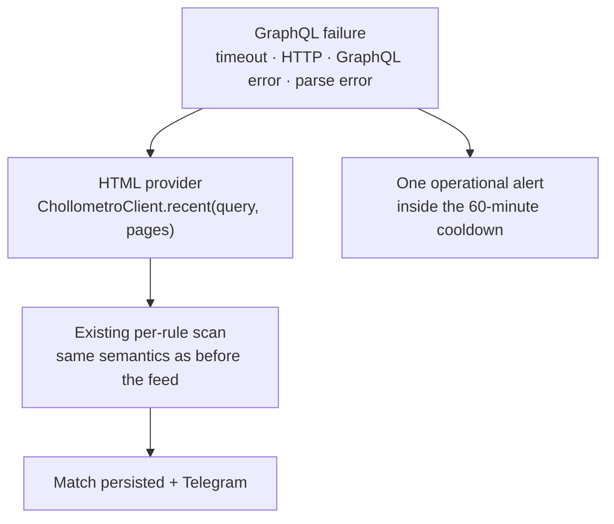

# 🛒 Chollometro Alerts

Smart deal monitoring for [Chollometro](https://www.chollometro.com/) with configurable alert rules, automated product analysis and Telegram notifications.

The daemon discovers new deals through Chollometro's **internal GraphQL feed** (the newest threads, fetched once per cycle) and falls back to the public HTML searches when that API cannot be reached. Every unseen deal is then extracted, priced and evaluated against the active alert rules before deciding whether an alert should be sent.

It combines deterministic extraction with optional **LLM-powered analysis using DeepSeek**, while keeping pricing calculations and deal decisions deterministic and reproducible.

## ✨ Features

* 🔎 **Automated deal monitoring** through the internal GraphQL feed (one request per cycle), with the public HTML searches kept as fallback
* 🚨 **Configurable alert rules** for different products and searches
* 🆕 **New-deal detection** using persistent SQLite state
* 🧠 **Hybrid product extraction**

  * deterministic parsing when possible
  * DeepSeek LLM fallback for ambiguous product information
* 📦 Structured extraction of product attributes such as quantity and total volume
* 💰 Deterministic **price-per-unit analysis**
* 🎯 Rule-based filtering before sending notifications
* 🏪 **Per-alert shop filters**: `de Amazon o PcComponentes pero no AliExpress`
  (allowed/excluded merchants, decided deterministically, before the LLM)
* ⏱️ **Per-alert notification hours**: `solo entre las 08:00 y las 23:00`,
  in a real timezone. A deal found outside the window is **not lost**: it stays
  pending and is sent as soon as the window opens.
* 📲 **Telegram notifications** for matching new deals
* 🧾 **Explainable notifications**: each alert names the deal, the alert that matched, the conditions that held and the evaluation method
* 💾 Persistent extraction cache to avoid unnecessary LLM calls
* 🔁 Safe retry behaviour for failed notifications
* 📊 Runtime metrics for LLM usage, cache hits and detected deals
* 🧪 Dry-run and baseline modes for safe testing
* 🔐 Environment-based secret management

## 🏗️ How it works

The daemon runs one discovery cycle every `SCAN_INTERVAL_MINUTES` (10 by default): a single GraphQL request, per-`threadId` deduplication, one evaluation per new deal and one Telegram message per accepted match.



When the GraphQL call fails the cycle degrades to the unchanged HTML provider, per active rule:



The LLM is intentionally limited to **extracting structured facts from the deal**. It does not decide whether a product is a good deal, it never decides whether a shop is allowed or excluded (`merchant in allowed_merchants` is a deterministic comparison), and it does not calculate prices. The merchant filter runs **before** the provider is called, so an excluded shop never spends an LLM request.

This separation keeps the decision pipeline deterministic, testable and easier to extend.

## 🔎 GraphQL discovery feed

The discovery path is `POST https://www.chollometro.com/graphql`, using the root
field `threads` (`ChollometroClient` speaks HTML; `GraphQLFeedClient` speaks
this API). One request is sent per cycle, it is never executed once per alert,
and the HTML provider stays available as the fallback.

> ⚠️ **This is an internal, undocumented API.** It is what the site's own
> front-end uses, not a published developer contract: it can change, require a
> session or disappear without notice. Treat every field as best-effort and
> keep the HTML fallback in mind when changing the query.

* **Request shape.** A plain JSON `POST` with `operationName` and `query`, over
  a persistent `requests.Session` that first does one `GET` of the homepage to
  obtain the session cookies (a stale session is re-handshaked once). No cookie
  or token value is ever logged: only booleans such as `xsrf_present`.
* **Structured data.** The answer is JSON (`data.threads[]`), so no HTML
  parsing is involved: `threadId`, `title`, `url`, `price`, `nextBestPrice`,
  `temperature`, `publishedAt`, `status`, `isExpired`,
  `descriptionPurified(maxLength: 400)`, `merchant`, `groups` and `mainImage`
  are mapped straight onto the `Deal` model.
* **Identity is `threadId`**, the same value the HTML parser reads from
  `article[id="thread_<id>"]`, so `new`/`seen` bookkeeping is shared between
  both providers and a deal is never announced twice.
* **`publishedAt`** (epoch seconds, converted to UTC) is the provider timestamp
  of the deal; it is what the alert window compares against.
* **Window.** The request deliberately omits `limit`: the endpoint then answers
  with its widest window (30 threads, newest first). `limit` 1–20 asks for
  exactly that many; `limit >= 21` is silently clamped to 20 by the server, so
  `limit: 30` is never sent and a configured value outside 1–20 is rejected at
  startup.
* **No pagination.** `threads` accepts only `filter` and `limit`. There is no
  cursor, `after`/`before`, `first`/`last`, `offset`, `page`, `skip` or
  `start`, and no `pageInfo`/`hasNextPage`. `threadId: {in: [...]}` does work
  (it re-reads specific ids); `gt`/`lt`/`ge`/`le` are accepted but ignored and
  `sort` is accepted but does not change the order, so none of them is used.
* **Switch**: `CHOLLOMETRO_GRAPHQL_DISCOVERY=false` restores the original
  HTML-only behaviour and never touches the GraphQL endpoint.

## 🛡️ Chollometro failure handling

**ESCANEO CORRECTO + 0 RESULTADOS ≠ FALLO DE CHOLLOMETRO.** An empty but
complete search is `SUCCESS` with 0 deals; a search that could not be completed is
`FAILED`. Both states are distinguished in the scanner, in `scan_runs.status`, in
the logs, in the metrics (`SCAN_STATUS`, `SCAN_ERROR_TYPE`) and in the CLI
(`SCAN_STATUS=FAILED` and exit code 1 for `check` / `baseline`).

* **Timeout**: every request carries an explicit timeout
  (`CHOLLOMETRO_TIMEOUT_SECONDS`, default 20 s), so nothing waits forever.
* **Retries and backoff**: transient failures are retried up to
  `CHOLLOMETRO_MAX_RETRIES` times (default 2) with exponential backoff starting at
  `CHOLLOMETRO_RETRY_BACKOFF_SECONDS` (0.5 s) and capped at
  `CHOLLOMETRO_MAX_RETRY_BACKOFF_SECONDS` (30 s). The budget is bounded: no
  infinite loops, and the sleep is injectable so tests never wait.
* **429**: transient, and a numeric `Retry-After` is honoured within the backoff
  cap.
* **5xx** (`500`, `502`, `503`, `504`, plus `408`): transient, retried within the
  same budget.
* **4xx** (`400`, `401`, `403`, `404`): permanent, never retried, the scan fails.
* **Parse failures**: a 200 response that is not a recognisable Chollometro
  results page (captcha, error page, changed markup, empty body) raises a
  `ChollometroParseError`. An empty result set must say so in the page itself; it
  is never assumed from a missing payload.
* **Total failure**: no page was read, so nothing is evaluated, persisted,
  matched or notified, the previous baseline is untouched and no LLM call is
  spent. `scan_runs.error_type` records `TIMEOUT`, `NETWORK_ERROR`, `HTTP_503`,
  `PARSE_ERROR`, ...
* **Partial failure**: when page 1 answers and page 2 fails, the deals of page 1
  are kept (observations are claimed per deal, so the missing pages are simply
  discovered in a later cycle) but the scan is recorded as `PARTIAL`, never as a
  complete success. A rule whose **baseline** is being taken is stricter: an
  incomplete baseline fails closed (`INITIALIZING_FAILED`, rule disabled), because
  a partial baseline would silently hide deals.
* **Daemon recovery**: a provider failure is logged, recorded as `FAILED` and the
  daemon waits for the next cycle instead of exiting. Retries inside one scan
  produce at most one operational Telegram alert per logical failure (existing
  60-minute cooldown per error type), so a `503` never becomes alert spam, and no
  "0 chollos encontrados" message is ever sent for a failure.

## ⚙️ Configuration

Everything is read from the environment (`.env` in the project root, loaded on
start-up). The names and defaults below are the ones the code really uses
(`config.py`, `cli.py`, `runtime.py`):

| Variable | Default | Purpose |
| --- | --- | --- |
| `TELEGRAM_BOT_TOKEN` | *required* | Bot token used to send alerts. |
| `TELEGRAM_CHAT_ID` | *required* | Authorised chat that receives them. |
| `CHOLLOMETRO_GRAPHQL_DISCOVERY` | `true` | Enables the GraphQL discovery feed. `false` keeps the HTML-only behaviour and never touches the endpoint. |
| `CHOLLOMETRO_GRAPHQL_WINDOW_LIMIT` | unset | Unset = the request sends no `limit` and the endpoint answers with its widest window (30 threads). A value between 1 and 20 asks for that many explicitly. Anything else is rejected at start-up. |
| `CHOLLOMETRO_GRAPHQL_PATH` | `/graphql` | Endpoint path, relative to the site. |
| `CHOLLOMETRO_TIMEOUT_SECONDS` | `20` | Timeout of every Chollometro request. |
| `CHOLLOMETRO_MAX_RETRIES` | `2` | Bounded retry budget (never retries 4xx or parse failures). |
| `CHOLLOMETRO_RETRY_BACKOFF_SECONDS` | `0.5` | Base of the exponential backoff. |
| `CHOLLOMETRO_MAX_RETRY_BACKOFF_SECONDS` | `30` | Backoff cap. |
| `SCAN_INTERVAL_MINUTES` | `10` | Delay between discovery cycles in `run` (overridden by `--interval-minutes`). |
| `LLM_ENABLED` | `false` | Enables the DeepSeek extraction fallback. |
| `LLM_PROVIDER` | `deepseek` | Only supported provider. |
| `DEEPSEEK_API_KEY` | — | Required when `LLM_ENABLED=true`. |
| `DEEPSEEK_MODEL` | `deepseek-flash` | Model asked for the extraction. |
| `DEEPSEEK_TIMEOUT_SECONDS` | `20` | LLM request timeout. |
| `DEEPSEEK_MAX_RETRIES` | `2` | LLM retry budget. |
| `ALERT_TIMEZONE` | `Europe/Madrid` | Default timezone of the per-alert notification windows. An alert that names its own timezone always wins. |
| `MILK_*`, `BEER_*` | — | Legacy thresholds of the env-configured rules used by `check`, `baseline` and `run-rules --dry-run`. |

> `ERROR_ALERT_COOLDOWN_MINUTES` appears in `.env.example`, but no code reads it
> today: the operational-alert cooldown is fixed at 60 minutes in
> `AlertService.notify_error`. Setting it has no effect.

## ▶️ Running the project

Install it once, in a virtual environment of your choice (the package is a plain
`setuptools` project that exposes the `chollometro-alerts` entry point):

```bash
python -m venv .venv
source .venv/Scripts/activate      # Windows PowerShell: .venv\Scripts\Activate.ps1
pip install -e .
```

Create the configuration file from the example and fill in your secrets:

```bash
cp .env.example .env                # Windows: Copy-Item .env.example .env
```

`pytest` and `ruff` are the development tools used below; they are **not**
declared as dependencies of `pyproject.toml`, so install them separately (for
example `pip install pytest ruff`).

`tzdata` **is** a declared dependency: `zoneinfo` reads the IANA database from
the operating system, and Windows does not ship one, so the per-alert
notification windows need the package to resolve `Europe/Madrid` (or any other
zone). Installing the project (`pip install -e .`) is enough.

### `check`: one-shot run

```bash
chollometro-alerts check            # add --dry-run to skip Telegram
```

`check` is the legacy one-shot path: it performs a single HTML scan of the
built-in `leche` query with the env-configured rule (`MILK_*`), prints the run
metrics and exits (exit code `1` when the scan failed, which is what cron and
monitoring read). It does not use the GraphQL feed. Without `--dry-run` it
requires `TELEGRAM_BOT_TOKEN` and `TELEGRAM_CHAT_ID`.

### `run`: the daemon

```bash
chollometro-alerts run                          # every SCAN_INTERVAL_MINUTES
chollometro-alerts run --interval-minutes 5     # explicit interval
```

`run` keeps a process alive: it starts the Telegram listener (so alert rules can
be created and edited from chat) in one thread and runs the discovery cycle
every `interval_minutes * 60` seconds in the other, until it is interrupted.
Each cycle is the GraphQL feed + fallback described above.

Other entry points: `baseline`, `run-rules --dry-run`, `alert parse|add|list|test`,
`telegram-poll`, `telegram-listen` and `test-llm "<text>"`.

## 💾 Persistence

Everything lives in one SQLite file (`--db`, `deals.sqlite3` by default):

| Table | What it holds |
| --- | --- |
| `deals` | The deals already seen, keyed by `deal_id`, with `published_at`, `first_seen_at` and `notified_at`. |
| `alert_rules` | The persisted alerts: `query`, `product_type`, `brand`, `max_price`, `price_unit`, `enabled`, `state`, `created_at`, `updated_at`. The structured rule (`structured_rule`) additionally carries the allowed/excluded shops and the notification window. |
| `feed_threads` | **One row per thread ever seen in the GraphQL feed** (`thread_id` primary key, `published_at`, `first_seen_at`). Its existence is the "seen" state that makes the discovery cycle evaluate only new deals. |
| `feed_state` | Key/value state of the feed: `bootstrap_at` (the database saw its first discovery cycle) and `newest_published_at` (the watermark of the previous cycle). |
| `rule_deal_observations` | One row per (`rule_id`, `deal_id`): the durable verdict, its `baseline`/`matched` flags, the rejection reason, `notified_at`, the stored match evidence and `pending_reason` (`TELEGRAM_FAILURE` / `NOTIFICATION_SCHEDULE`) while the pair is still waiting for Telegram. |
| `deal_rule_matches` | The accepted (`deal_id`, `rule_id`) pairs and when they were matched and notified. |
| `product_extractions` | The extraction cache (one JSON payload per deal) that avoids repeated LLM calls. |
| `scan_runs` | One row per cycle and per HTML scan: counters, timings, HTTP status, `status` and `error_type`. The discovery cycle is recorded as `query='graphql:feed'`. |
| `telegram_updates` | The Telegram update ids already processed. |
| `error_alerts` | The operational alerts sent, with their fingerprint and cooldown timestamps. |

`feed_threads` is what makes "only new deals" true: a `threadId` present there is
never evaluated again, whichever provider saw it first.

Both additions are **additive and optional**: the new columns and the two new
fields of the structured rule are only written when they are used, and a
database created before them is migrated in place (the `pending_reason` column
is added by `_initialize()`), so existing alerts keep their exact previous
behaviour.

## 🚀 Example

An alert can be as small as:

```text
"cerveza"
```

The first discovery cycle on a fresh database **initializes the feed state while still evaluating what the alerts can prove to be new**, so a chollo published between the creation of an alert and the first daemon cycle is never lost. Every deal of every cycle goes through the same pipeline:

```text
New Chollometro thread (threadId not in feed_threads)
        ↓
Extract product information (deterministic, LLM only when needed)
        ↓
Calculate comparable price
        ↓
published_at > alert.created_at ?
   ├── No  → never notified for this alert
   └── Yes → evaluate the rule
                ├── reject → store the verdict, no notification
                └── match  → persist the match → Telegram → notified_at
```

This makes it possible to monitor products continuously without ever notifying a deal that already existed when the alert was created.

## 🏪 Shops: allowed and excluded merchants

An alert may name the shops it wants and the ones it refuses:

```text
Avísame de portátiles gaming por menos de 1000 € de Amazon o PcComponentes, pero no AliExpress
```

The rule stores both lists inside the structured alert (`include_merchants` is
`allowed_merchants`, `exclude_merchants` is `excluded_merchants`; the names
follow the existing `InterestRule` fields):

```text
allowed_merchants  = [Amazon, PcComponentes]
excluded_merchants = [AliExpress]
```

| Rule | Deal's shop | Verdict |
| --- | --- | --- |
| `allowed = [Amazon, PcComponentes]`, `excluded = [AliExpress]` | Amazon | **PASS** |
| `allowed = [Amazon, PcComponentes]`, `excluded = [AliExpress]` | PcComponentes | **PASS** |
| `allowed = [Amazon, PcComponentes]`, `excluded = [AliExpress]` | AliExpress | **FAIL** (the exclusion wins) |
| `allowed = [Amazon, PcComponentes]`, `excluded = [AliExpress]` | MediaMarkt | **FAIL** |
| `allowed = []`, `excluded = [AliExpress]` | Amazon / PcComponentes / MediaMarkt | **PASS** |
| `allowed = []`, `excluded = [AliExpress]` | AliExpress | **FAIL** |

* **An empty allow list means "any shop except the excluded ones".** An alert
  with neither list is exactly the previous behaviour: every shop passes.
* **The exclusion list always wins**: a shop present in both lists is rejected.
* **The decision is deterministic and runs before the model.** It comes from
  `merchants.merchant_verdict()`, never from an LLM answer to "is this merchant
  in the list?", and it is applied before the deal is sent to DeepSeek, so an
  excluded shop spends no LLM request. The verdict is stored as
  `REJECTED_MERCHANT` (excluded) or `REJECTED_MERCHANT_NOT_ALLOWED` (outside
  the allow list).
* **Normalisation is robust but never fuzzy**: case, accents, surrounding
  spaces, internal space runs and punctuation are folded, so `pc componentes`,
  `PcComponentes` and `PC COMPONENTES` are the same shop, and
  `Showroomprivé` is `Showroomprive`. Nothing else is normalised:
  `Amazon Marketplace XYZ` and `Amazon.de` are **not** `Amazon`, because a
  longer name is never accepted by substring matching.
* **Where the name comes from**: the GraphQL feed's
  `merchant.merchantName` and the HTML card's `data-t="merchantLink"` text,
  both mapped to `Deal.merchant`. A deal without a merchant name cannot prove
  an allow list, so it is rejected when the rule has one; with only an
  exclusion list it passes, exactly as before, because an unknown name cannot
  prove an exclusion either.

## ⏱️ When a deal may be notified

An alert is bounded in time: it can only notify deals **strictly newer** than the moment the alert was created.

```text
deal.published_at > alert.created_at
```

| Relation | Result |
| --- | --- |
| `published_at < created_at` | never notified |
| `published_at == created_at` | never notified (the comparison is strict) |
| `published_at > created_at` | evaluated normally |

Both timestamps are compared in UTC: `published_at` comes from the provider (`publishedAt` in GraphQL, the card timestamp in HTML) and `created_at` from the stored rule. A deal **without** a timestamp is never considered "published after": the alert cannot prove it is new, so it stays silent.

**Where the comparison lives.** The GraphQL discovery cycle enforces it directly, per alert (`published_at > alert.created_at`). The HTML fallback cannot: the cards it parses usually carry **no timestamp at all**, so the same user-visible guarantee comes from the **rule baseline** taken when the alert is created — the deals already in the page are claimed and never announced, and a deal that appears afterwards is evaluated. Both paths agree on the outcome (a deal that existed when the alert was created is never announced); the mechanism differs, and both are covered by tests.

The comparison is **per alert**, never one global date: a deal is eligible for the alerts that already existed when it was published, and invisible to the ones created later.

**First discovery cycle (bootstrap).** On a fresh database the first cycle initializes the state of the feed **and** keeps the deals the alerts can prove to be new. The window is the reference for everything older — those deals only initialize the historical state — but a deal published *after* an alert was created is eligible for that alert and goes through the whole pipeline (temporal gate → filters → extraction → evidence → persistence → Telegram) in this very first cycle. Anything else would silently lose every chollo published between the creation of the alert and the first daemon cycle. After the cycle, the whole window is registered in `feed_threads`, so the next cycle with the same feed evaluates and notifies nothing again.

```text
Alert created                10:00

First feed scanned by the daemon
  A        09:50   published before the alert   recorded as seen, never notified
  B        10:00   exactly at the alert          recorded as seen, never notified
  C        10:05   published after the alert     evaluated → matches → Telegram
  D        10:06   published after the alert     evaluated → rejected, no message

After the cycle   A B C D  registered as seen
Second cycle, same feed       0 evaluations, 0 notifications
```

### Horario de envío (por alerta)

An alert can also choose **when** its messages may be sent:

```text
Avísame de portátiles solo entre las 08:00 y las 23:00
Avísame de portátiles de 22:00 a 07:00
Avísame de portátiles de 08:00 a 23:00 Europe/Madrid
```

The window is stored per alert (`notification_window`: `start`, `end` and an
IANA `timezone`) and is **empty by default**: an alert without a window behaves
exactly as before, notification immediately.

**The window controls Telegram, it never decides the match.** A deal found
outside the window is still a match, and **no chollo is lost**:

```text
03:00  a compatible deal appears
       ↓
       MATCH             (rules, pricing and LLM: all unchanged)
       ↓
       match persisted   ← the chollo is already safe at this point
       ↓
       no Telegram yet: pending_reason = NOTIFICATION_SCHEDULE
       ↓
08:00  the window opens
       ↓
       Telegram sent → notified_at
```

* **Inclusive bounds.** `08:00 → 23:00` allows `08:00` and `23:00`; a window
  whose start and end are equal is documented as "the whole day", never as
  "never send anything".
* **Windows that cross midnight** are supported: with `22:00 → 07:00`, the
  hours `22:00-23:59` and `00:00-07:00` are allowed and `07:00-22:00` is not.
* **Timezone.** Every window carries an explicit IANA timezone,
  `Europe/Madrid` by default (`ALERT_TIMEZONE` changes the default for alerts
  that do not name one). The hour is compared with the **local wall clock of
  that zone** through `zoneinfo`, never by comparing an UTC timestamp with a
  local hour, so DST is handled by the zone itself: the same `08:00-23:00`
  window opens at `07:00 UTC` in winter and at `06:00 UTC` in summer, and the
  skipped hour of the spring change (`02:00 → 03:00`) is simply not part of any
  window.
* **The pending states stay distinguishable.** `rule_deal_observations`
  carries `pending_reason`: `TELEGRAM_FAILURE` when a delivery really failed,
  `NOTIFICATION_SCHEDULE` when the alert's own window is holding the match
  back. Both reuse the same pending mechanism — a durable match with
  `notified_at` NULL — and both are delivered **once** by the next cycle that
  is allowed to send. Nothing new had to be built for this.
* **Where it is checked.** After the match is decided and persisted (never
  before), both for a fresh match and for a retry of an older pending one.

## 🔄 The discovery cycle, step by step

1. **Fetch the feed** — `GraphQLFeedClient.latest()` sends one `POST /graphql` with bounded retries and a single session handshake.
2. **Identify** every thread by `threadId`.
3. **Register / deduplicate** — the window itself is deduplicated by `threadId` and compared with `feed_threads`. On the very first cycle every thread is new, so the whole window is recorded (after its per-rule outcome is durable, exactly like any other cycle).
4. **Select the new deals** — only the threads never recorded before. The first cycle selects the whole window, and the temporal filter of step 6 decides which of those deals an alert can really prove to be new.
5. **Compare against the active alerts** — every enabled rule of `alert_rules`, all sharing that single fetch.
6. **Temporal filter** — `published_at > alert.created_at`; otherwise the pair is skipped without being evaluated or notified.
7. **Merchant filter** — `include_merchants` / `exclude_merchants` of the alert, decided deterministically **before** any provider call: an excluded shop (or one outside the allow list) is rejected here and never reaches the LLM.
8. **Deterministic evaluation** — `PricingEngine` and `InterestEngine` decide on prices, quantities, volumes, brands and thresholds.
9. **LLM only when it corresponds** — DeepSeek is asked only when the local parser cannot produce the facts the rule needs (`LLM_ENABLED=false` keeps the pipeline fully deterministic).
10. **Persist the match** — `deal_rule_matches` plus the `rule_deal_observations` verdict and evidence, written *before* Telegram.
11. **Notification window** — if the alert has one, it is checked now, after the match is durable: inside it the message is sent, outside it the pair stays pending (`NOTIFICATION_SCHEDULE`) for a later cycle.
12. **Telegram** — exactly one message per accepted (deal, rule) pair.
13. **`notified_at`** — written only after the delivery succeeded.

**If Telegram fails** the match stays durable and the pair is left pending
(matched, not notified, `pending_reason = TELEGRAM_FAILURE`). The next cycle
retries it before anything else, from the stored deal and the stored evidence,
even if the deal has already left the provider window. A retry can never send a
second message for an already-notified pair, and a Telegram outage can never
mark a deal as processed without having notified it. The same pending pass
delivers the pairs a **notification window** left waiting, which is why the two
reasons are stored separately.

## 🧾 Explainable notifications

Each message is built from `MatchEvidence`, which the evaluation engine derives from the values it really compared — never from the deal's category:

* the deal: title, price, merchant, temperature and URL;
* the alert that produced the match (its stored text, or its query);
* the conditions that held, one per line (`✅ Cumple:`);
* the semantic contribution when the model supplied facts the local parser could not (`🤖 Coincidencia semántica`) — facts only, never prompts or internal reasoning;
* the evaluation method: `deterministic`, `llm` or `hybrid` (`🧠 Evaluación`).

The shop is quoted twice when it took part in the decision: as the deal's line
(`🏪 Tienda: PcComponentes`) and as the condition that was really compared
(`• Tienda permitida: PcComponentes`, `• Sin tiendas excluidas: AliExpress`).
When the alert has no merchant lists, no merchant condition is claimed.

The evidence is stored next to the match, so a retried delivery explains the original match again instead of sending a bare deal.


## 🔁 Deterministic rule evaluation

`AlertRule.constraints` supports `max_price`, `max_price_per_liter`,
`max_price_per_unit`, `min_quantity`, `min_volume_l` and `min_temperature`, and
every constraint present in the rule must hold. `PricingEngine` derives the
comparable prices (`price_per_liter`, `price_per_unit`) from the extracted facts,
so `InterestEngine` only compares numbers; when the required fact is unknown (for
example the quantity of a `max_price_per_unit` rule) the deal is rejected as
`REJECTED_UNKNOWN_QUANTITY` instead of assuming one unit. The `max_price*` limits
are exclusive: the price must be strictly below the configured value.

Outside `constraints`, a rule also carries the shops it allows and excludes
(`include_merchants`, `exclude_merchants`) and, optionally, a per-alert
`notification_window`. The merchants are part of the same deterministic engine
(`InterestEngine`); the window is not a matching condition at all, it only gates
the Telegram delivery (see [Shops](#-shops-allowed-and-excluded-merchants) and
[Horario de envío](#horario-de-envío-por-alerta)).

Production scans, `run-rules --dry-run` and `alert test` share the same path
(`repository.rule_from_row()` → `AlertRule` → `InterestRule` → `PricingEngine` →
`InterestEngine`) and differ only in where the deals come from, which side effects
are allowed and how the verdict is presented.

### Product matching

The alert `product` is compared with the extracted `product_type` word by word,
after normalising case, accents, punctuation and a simple Spanish plural
(`zapatilla` matches `zapatillas`). The extracted type may carry qualifiers
*after* the product, so `zapatillas` matches `Zapatillas running asfalto` and
`mini pc` matches `Mini PC NAS`.

This is still a deterministic comparison, not semantic matching: `zapatillas`
never matches `running shoes`, and a trailing qualifier on its own is not a
match (`leche` does not match `chocolate con leche`). When the product fact is
missing the verdict is unchanged, so the replay keeps reporting it as
`NOT_EVALUABLE` instead of a wrong rejection.

### Merchant matching

The alert's `include_merchants` / `exclude_merchants` are compared with
`Deal.merchant` through a normalised key (case, accents, spaces and punctuation
folded) and the exclusion list wins. It is the same conservative, deterministic
idea as the product comparison: `Pc Componentes` and `PcComponentes` are the
same shop, while `Amazon Marketplace XYZ` is a different one. The comparison
never falls back to the model and, because it does not need any extracted fact,
it can be — and is — applied before the LLM is called.

### Creating and correcting alerts

Rules are created, updated and removed from Telegram using plain language, and
the price dimension follows the sentence:

```text
Avísame de zapatillas ASICS por menos de 200 €        → max_price = 200
Avísame de Coca-Cola por menos de 0,50 € por unidad   → max_price_per_unit = 0.50
Avísame de leche por menos de 0,79 € por litro        → max_price_per_liter = 0.79
Cambia la alerta 2 para avisarme de zapatillas ASICS por menos de 200 €
```

An update finds the existing rule by its `query` and `brand` (the numeric id in
the message is only the operator's reference), rewrites the `max_price` /
`price_unit` columns, replaces the structured rule and keeps the product and
brand that were already stored. After that, `alert test <id>` replays the
corrected price semantics. The CLI equivalents for a *new* rule are
`chollometro-alerts alert parse "<texto>"` and
`chollometro-alerts alert add "<texto>"`.

The same sentence can carry the shops and the notification hours:

```text
Avísame de portátiles gaming por menos de 1000 € de Amazon o PcComponentes, pero no AliExpress
Avísame de portátiles gaming por menos de 1000 € solo Amazon
Avísame de portátiles gaming por menos de 1000 € de Amazon o PcComponentes pero no AliExpress, y solo entre las 08:00 y las 23:00
```

| Expression | Stored as |
| --- | --- |
| `de Amazon`, `solo Amazon`, `de Amazon o PcComponentes`, `Amazon y PcComponentes` | `include_merchants` |
| `no AliExpress`, `excepto AliExpress`, `excluir AliExpress` | `exclude_merchants` |
| `solo entre las 08:00 y las 23:00`, `avísame de 8:00 a 23:00`, `08:00-23:00` | `notification_window` |
| `… Europe/Madrid`, `hora peninsular`, `hora española` | `notification_window.timezone` |

The shop lists and the hours are read from the sentence itself
(`alert_text.py`), not only from the model, and the deterministic reading wins:
it comes from the literal text, so it cannot be a hallucination. The model
still covers what that reader does not understand (a lowercase shop name, a
language it does not speak).

**Vague periods are never invented.** `no me avises por la noche` is
recognised, and the bot answers asking for the exact hours
(`«por la noche»: no tengo una definición de ese horario: dime las horas
exactas, por ejemplo «entre las 23:00 y las 07:00»`) instead of silently
deciding that "night" means `22:00-08:00`. The same rule applies to
`de madrugada`, `por la mañana` and `por la tarde`.

The same correction can be applied from Python through the canonical boundary,
without touching the legacy columns by hand:

```python
from chollometro_alerts.intent import AlertIntent, intent_to_rule
from chollometro_alerts.repository import DealRepository

repository = DealRepository("deals.sqlite3")
intent = AlertIntent(
    action="update",
    query="zapatillas",
    product_type="zapatillas",
    brand="ASICS",
    max_price=200,
    price_unit="absolute",
)
repository.apply_alert_intent(intent)
repository.attach_alert_rule(2, intent_to_rule(intent), "texto original")
```

## 🧪 Testing an alert against historical deals

`alert test` replays a persisted rule against the deals already stored locally, so
a rule can be validated without waiting for new deals:

```powershell
chollometro-alerts alert test 12
chollometro-alerts alert test 12 --limit 100
```

Example output:

```text
RULE #12

Query: zapatillas
Product: zapatillas
Brand: ASICS
max_price: 80

Historical deals available: 87
Deals evaluated: 53

MATCH:        6
REJECT:       43
NOT_EVALUABLE: 4
```

`alert test` is a read-only simulator:

* it uses deals already known locally (`--limit` caps how many are evaluated,
  default 200; `--limit 0` evaluates all of them);
* it never scrapes: no new requests to Chollometro;
* it never calls the LLM: it reuses the cached `ProductExtraction` and, when there
  is none, only the deterministic extraction of the stored text;
* it never sends Telegram;
* it never changes state: no deals, extractions, observations, baseline,
  `notified_at`, matches or `scan_runs` are created or modified.

The report distinguishes:

* `MATCH`: the rule would have alerted for that deal;
* `REJECT`: the deal is rejected with the existing reason (`REJECTED_PRICE`,
  `REJECTED_PRICE_PER_UNIT`, `REJECTED_BRAND`, `REJECTED_QUANTITY`, ...);
* `NOT_EVALUABLE`: local data is not enough to check the rule (for example an
  unknown quantity or volume, `REJECTED_UNKNOWN_QUANTITY`). Production semantics
  do not change; only the replay report labels it this way.

When `Historical deals available` is 0 the replay says nothing about the rule:
there were no local deals to replay yet, so **0 matches does not mean the alert is
broken**.

## ⚠️ Known limitations

### GraphQL is a private API

`POST /graphql` is the site's internal endpoint: undocumented, unversioned and
not a stable public contract. Fields, arguments or the whole endpoint can change
— or start requiring a session — without notice. The HTML fallback exists
precisely for that, and a GraphQL failure never stops the daemon.

### Feed window

The feed is a visibility window, not a complete list: whatever leaves the window
between two cycles is never seen. Measured against the live endpoint, omitting
`limit` returns 30 threads, an explicit `limit` of 1–20 returns exactly that
many, and `limit >= 21` is silently clamped to 20. **These are observations from
testing, not an official guarantee.** The cycle logs when it detects a risk of
having missed threads: `feed_window_risk reason=no_overlap` (a window that
overlaps nothing already recorded, after a non-empty history) and
`feed_window_gap` (the oldest thread of a cycle is newer than the previous
watermark). `feed_window_saturated` is informational only: a full window is the
normal case and by itself proves nothing.

### No known pagination

No reliable pagination was found for `threads`: it accepts only `filter` and
`limit`, with no cursor, `after`/`before`, `first`/`last`, `offset`, `page`,
`skip`, `start` or `pageInfo`. The only verified way to read past the newest
window is to request ids explicitly with `threadId: {in: [...]}`, which requires
knowing them beforehand; `gt`/`lt`/`ge`/`le` are accepted but ignored and `sort`
is accepted but does not change the order. A future recovery pass could walk
descending id windows from the oldest stored `threadId` until it overlaps the
stored history, but nothing like that is implemented today.

### HTML fallback is not equivalent

The fallback is the original HTML scan, run once per active rule: it only sees
what each rule asks for, it depends on the page markup, and a partially failed
scan is recorded as `PARTIAL`. A cycle served by the fallback does not have the
same coverage as a GraphQL discovery cycle.

### The notification window is checked per cycle

A pending match is delivered by the first **cycle** that falls inside the
window, not at the exact minute the window opens: with
`SCAN_INTERVAL_MINUTES=10` a match found at 03:00 is sent within the first ten
minutes after `08:00`. Windows are daily (no "weekends only") and there is no
per-alert quiet-hours calendar beyond the single window.

### Vague periods are not defined

Nothing in the product says what "por la noche" means, so the parser refuses to
invent it: it asks for concrete hours. If a house definition is ever wanted, it
belongs in the configuration (and the parser), not in a silent guess.

### `feed_threads` is never pruned

One row is kept forever for every thread the feed has ever discovered: there is
no pruning job. Lookups stay cheap (the lookups go through the primary key), but
the table only grows.

## 🧪 Testing

```bash
python -m pytest -q
ruff check .
ruff format --check .
```

The suite is offline: the HTTP sessions, the clock and the sleeps are injected,
so no test touches Chollometro, Telegram or a real backoff. The test count is
deliberately not hardcoded here.

The shop filters and the notification windows have their own offline suites:
`tests/test_merchant_filters.py` (allow list, exclusion priority,
normalisation, "the filter runs before the LLM", and the merchant names the
GraphQL and HTML providers really return) and
`tests/test_notification_schedule.py` (no window, normal and cross-midnight
windows, delivery of a pending match when the window opens, no duplicates,
timezone, the two DST changes of `Europe/Madrid` and both pending reasons).
`tests/test_alert_language.py` pins the sentences the bot understands and the
refusal to invent hours for a vague period.

## 🔐 Security

* `.env` is gitignored; only `.env.example` is versioned. Secrets belong in the
  environment, never in the repository.
* The Telegram bot token and the DeepSeek API key are credentials: anyone
  holding them can read your chat or spend your credits.
* The GraphQL session cookies are never logged, stored or printed: the cookie
  values live in memory for the lifetime of the process and the logs carry
  booleans (`xsrf_present`) only.
* Logs and operational alerts include error types, messages, titles, prices and
  ids — never tokens, cookies or credentials. The extraction cache stores
  product facts, not raw API payloads.

## 📌 Project status

* **GraphQL discovery is implemented and covered by the test suite** (feed
  client, discovery cycle, window metrics, fallback and explainable
  notifications): it is the default way of finding new deals, not a future
  experiment.
* **HTML is kept, not replaced**: it is the controlled fallback when the
  GraphQL API fails and the complete behaviour when
  `CHOLLOMETRO_GRAPHQL_DISCOVERY=false`.
* **Per-alert shops and notification hours are implemented and covered**:
  `include_merchants` / `exclude_merchants` are decided deterministically
  before the LLM, and `notification_window` gates Telegram without ever
  dropping a match (an alert without a window keeps notifying immediately).
